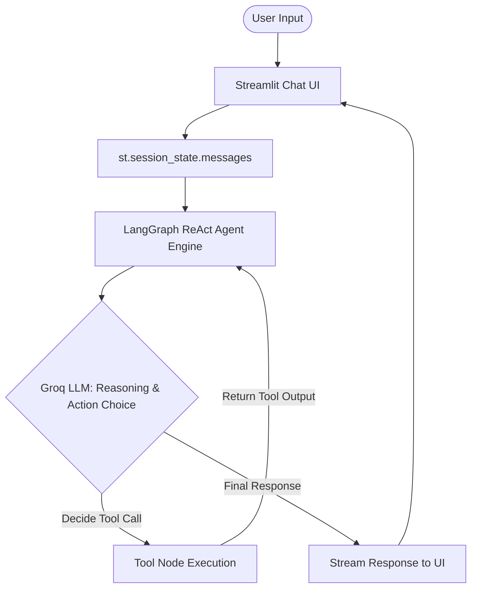

# 💬 GenAI Workshop - Streamlit ReAct AI Assistant

A production-ready, lightweight, single-file AI Assistant built with Python using **Streamlit**, **LangChain**, **LangGraph**, and **Groq**. 

This application demonstrates a state-of-the-art **ReAct (Reasoning + Acting)** pattern, combining real-time LLM inference with autonomous tool call execution (`calculator`, `say_hello`) under a cyclic state graph.

---

## 🏗️ Architecture & Workflow

The architecture is split into three main tiers: **Interface (Streamlit)**, **Orchestration (LangGraph)**, and **Inference (Groq Cloud)**.

### System Workflow Diagram


### The ReAct (Reasoning & Acting) Loop:
1. **User Prompt**: The user asks a question via the chat input box (e.g., *"What is 154 + 289?"*).
2. **State Construction**: Streamlit aggregates the chat history into a series of LangChain message objects (`SystemMessage`, `HumanMessage`, `AIMessage`).
3. **LLM Evaluation**: The agent engine sends messages to the selected Groq LLM (e.g., `qwen/qwen3.6-27b` or `llama-3.3-70b`).
4. **Tool Call Execution**: The LLM determines if a tool is required. If yes, it yields a tool call schema, and LangGraph's prebuilt agent engine executes the corresponding Python function (e.g., the `calculator` tool).
5. **Iteration & Resolution**: The tool's output is injected back into the conversation state. The LLM evaluates it again to formulate the final answer or make additional tool calls.
6. **Streaming Output**: The response is streamed back token-by-token directly into the Streamlit UI.

---

## ⚡ Features & Stack Highlight

*   💬 **Streamlit Frontend**: Clean, responsive messaging UI utilizing modern chat interfaces (`st.chat_message`, `st.chat_input`, `st.status`).
*   🛠️ **Autonomous ReAct Tools**: Exposes real Python methods to the agent using the `@tool` decorator, enabling safe, autonomous math operations and greetings.
*   🚀 **High-Speed Inference**: Powered by the **Groq API Cloud**, offering ultra-low latency token generation using open-weights models (`Qwen`, `Llama`, and `Gemma`).
*   🔄 **Predictable Cyclic State**: Uses **LangGraph** to model the loop behavior cleanly, overcoming the limitations of traditional, linear LLM chains.
*   🔒 **Secure Configurations**: Uses `python-dotenv` for API key handling, allowing a user override option directly from the UI sidebar.

---

## 🚀 Getting Started & Startup Instructions

### 1. Clone & Navigate
Ensure you are in the workspace folder:
```powershell
cd c:\Users\vpman\OneDrive\Desktop\GenAI_Workshop
```

### 2. Set Up Virtual Environment
Initialize and activate your virtual environment:
```powershell
python -m venv .venv
.\.venv\Scripts\activate
```

### 3. Install Dependencies
Install all required libraries listed in the `requirement.txt` file:
```powershell
pip install -r requirement.txt
```

### 4. Configure Environment Variables
Create a file named `.env` in the root folder and add your Groq API key:
```env
GROQ_API_KEY=gsk_your_actual_groq_api_key_here
```

### 5. Run the Application
Start the Streamlit application targeting [`app.py`](file:///c:/Users/vpman/OneDrive/Desktop/GenAI_Workshop/app.py):
```powershell
.venv\Scripts\streamlit.exe run app.py
```
*The app will automatically launch in your default browser at `http://localhost:8501`.*

---

## 📖 Interview Prep Guide: How This Project Was Built

Below are key questions and talking points designed to help you explain this project in technical job interviews.

### Q1: What is the main design pattern of this application?
> **Answer:** The application follows the **ReAct (Reasoning + Acting)** pattern. Instead of using a static, linear prompt template, the system allows the LLM to decide dynamically when to fetch fresh data or perform actions using external tools. It implements a cyclic graph loop where:
> $$\text{User Query} \rightarrow \text{Reasoning} \rightarrow \text{Action (Tool Call)} \rightarrow \text{Observation} \rightarrow \text{Reasoning} \rightarrow \text{Final Answer}$$

### Q2: Why did you choose LangGraph over standard LangChain Agents?
> **Answer:** Traditional LangChain agents (like the legacy `AgentExecutor`) can be difficult to customize, debug, and control. **LangGraph** models the agent flow as a stateful, directed cyclic graph (DAG). This provides:
> *   **Precise State Control:** The agent's state is stored in a clean, predictable schema.
> *   **Customizable Control Flow:** We can easily add conditional branches, human-in-the-loop checks, and custom memory routers.
> *   **Streamable Iterations:** It natively supports streaming steps, enabling us to display tool execution states (`st.status`) separately from agent token generation.

### Q3: How is conversational state managed in this single-page Streamlit app?
> **Answer:** Streamlit reruns the entire script from top to bottom upon every user interaction. To maintain conversational context without resetting the agent's memory, we utilize Streamlit's `st.session_state.messages` dictionary. 
> Before passing the conversation history to the LangGraph agent, we map the list of messages into LangChain-native message objects (`SystemMessage`, `HumanMessage`, and `AIMessage`). This ensures the model retains historical context across multiple turns.

### Q4: How do the tools function and interface with the LLM?
> **Answer:** Tools are standard Python functions decorated with LangChain’s `@tool` wrapper. They contain clean docstrings which act as instructions for the model. 
> The tool schemas (names, descriptions, and argument types) are bound to the Groq Chat model. When the LLM decides to trigger a tool, it returns a structured payload (JSON) specifying which tool to invoke and with what arguments. LangGraph's prebuilt agent catches this payload, runs the function, and injects the text response back into the message cycle.
