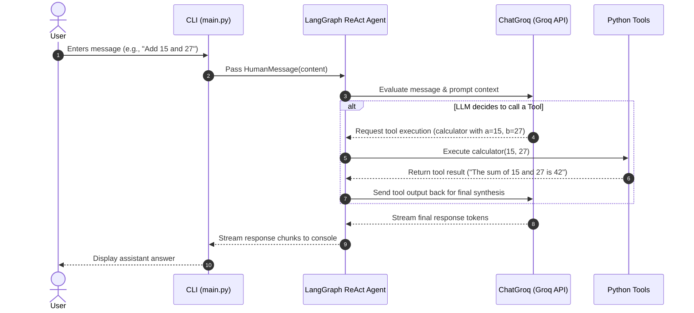

# GenAI Workshop - ReAct AI Agent Assistant

An interactive Command Line (CLI) AI Assistant built with Python, **LangChain**, **LangGraph**, and **Groq**. This project demonstrates the implementation of a **ReAct (Reasoning + Acting)** agent workflow capable of multi-turn conversation and autonomous tool execution.

---

## 📌 Table of Contents

- [Overview](#overview)
- [Key Features](#key-features)
- [Architecture](#architecture)
- [Workflow](#workflow)
- [Tech Stack](#tech-stack)
- [Project Structure](#project-structure)
- [Getting Started & Startup Guide](#getting-started--startup-guide)
  - [Prerequisites](#prerequisites)
  - [1. Clone / Open Project](#1-clone--open-project)
  - [2. Set Up Virtual Environment](#2-set-up-virtual-environment)
  - [3. Install Dependencies](#3-install-dependencies)
  - [4. Environment Configuration](#4-environment-configuration)
  - [5. Run the Application](#5-run-the-application)
- [Usage Examples](#usage-examples)
- [Extending the Agent](#extending-the-agent)

---

## 🌟 Overview

The **ReAct AI Agent Assistant** is designed to solve tasks by reasoning about user prompts and dynamically deciding whether to answer directly using the LLM or invoke registered external tools (such as arithmetic calculators or greeting modules). Powered by **Groq**'s ultra-fast LLM inference API and managed by **LangGraph**, the agent streams responses directly to the terminal for a smooth user experience.

---

## ⚡ Key Features

- 🧠 **ReAct Agent Design**: Utilizes LangGraph's prebuilt ReAct agent loop for multi-step reasoning and action execution.
- 🚀 **Groq Integration**: Powered by Groq's low-latency inference engine (e.g., `qwen/qwen3.6-27b`).
- 🛠️ **Custom Tooling**: Easily extensible Python functions annotated with the `@tool` decorator (`calculator`, `say_hello`).
- 🌊 **Real-Time Token Streaming**: Real-time terminal output streaming via `agent_executor.stream()`.
- 🔐 **Environment Configuration**: Key and model configuration managed safely via `.env`.

---

## 🏗️ Architecture

```
                      ┌────────────────────────┐
                      │       User Prompt      │
                      └───────────┬────────────┘
                                  │
                                  ▼
                      ┌────────────────────────┐
                      │      CLI REPL Loop     │
                      │       (main.py)        │
                      └───────────┬────────────┘
                                  │
                                  ▼
                      ┌────────────────────────┐
                      │   LangGraph ReAct Loop │
                      └─────┬────────────┬─────┘
                            │            │
             LLM Reasoning  │            │  Tool Execution
             (Groq API)     ▼            ▼  (@tool)
                      ┌──────────┐  ┌──────────────────────────┐
                      │ ChatGroq │  │  Registered Tools:       │
                      │  Model   │  │  - calculator(a, b)      │
                      └──────────┘  │  - say_hello(name)       │
                                    └──────────────────────────┘
```

### Architectural Components

1. **User Interface Layer (`main.py`)**: An interactive command-line REPL loop accepting continuous user input until `quit` is entered.
2. **Agent Layer (`langgraph.prebuilt.create_react_agent`)**: Orchestrates the reasoning-action loop. It determines if the prompt requires direct generation or tool calling.
3. **Model Layer (`langchain_groq.ChatGroq`)**: Interacts with the Groq API using specified LLM models (e.g., `qwen/qwen3.6-27b`).
4. **Tools Layer (`@tool`)**: Independent Python functions defining specific capabilities along with docstrings that inform the agent when and how to use them.

---

## 🔄 Workflow



1. **Initialization**: `.env` is loaded using `python-dotenv`, configuring `GROQ_API_KEY` and `GROQ_MODEL`.
2. **Agent Setup**: `create_react_agent` binds `ChatGroq` with the list of tools (`calculator`, `say_hello`).
3. **Execution Loop**:
   - The user inputs a message at the prompt (`You: `).
   - The message is wrapped in a `HumanMessage` object and passed to `agent_executor.stream()`.
   - The model inspects the prompt and tool descriptions. If a tool is required, it generates a tool call payload.
   - The agent invokes the python function, captures the return value, and feeds it back into the model context.
   - The synthesized final output is streamed chunk-by-chunk to the terminal.

---

## 💻 Tech Stack

| Technology | Role | Description |
| :--- | :--- | :--- |
| **Python 3.10+** | Core Language | Runtime environment |
| **LangChain Core** | Agent Framework | Provides message primitives (`HumanMessage`) and the `@tool` decorator |
| **LangGraph** | Orchestration | Provides `create_react_agent` for ReAct state processing |
| **LangChain Groq** | LLM Provider | Adapter for Groq's high-speed inference API |
| **python-dotenv** | Environment Manager | Reads environment settings from `.env` |

---

## 📁 Project Structure

```
GenAI_Workshop/
├── main.py             # Entry point: Tools definition, agent initialization & REPL loop
├── requirement.txt     # Project dependencies
├── .env                # API keys and environment configurations (git-ignored)
└── README.md           # Project documentation
```

---

## 🚀 Getting Started & Startup Guide

### Prerequisites

- **Python 3.10** or higher installed on your system.
- A **Groq API Key** (Get one for free at [console.groq.com](https://console.groq.com/)).

---

### 1. Clone / Open Project

Open your terminal or command prompt and navigate to the project directory:

```bash
cd path/to/GenAI_Workshop
```

---

### 2. Set Up Virtual Environment

It is recommended to use a Python virtual environment:

**Windows (PowerShell / CMD):**
```powershell
python -m venv .venv
.\.venv\Scripts\activate
```

**macOS / Linux:**
```bash
python3 -m venv .venv
source .venv/bin/activate
```

---

### 3. Install Dependencies

Install all required packages specified in `requirement.txt`:

```bash
pip install -r requirement.txt
```

---

### 4. Environment Configuration

Create or update the `.env` file in the root directory of the project:

```env
GROQ_API_KEY=your_groq_api_key_here
GROQ_MODEL=qwen/qwen3.6-27b
```

> 💡 **Note**: You can change `GROQ_MODEL` to any supported Groq model (e.g., `llama-3.3-70b-versatile`, `mixtral-8x7b-32768`, etc.).

---

### 5. Run the Application

Launch the interactive assistant:

```bash
python main.py
```

---

## 💬 Usage Examples

Once started, interact with your assistant directly in the CLI:

```text
Initializing Groq model: qwen/qwen3.6-27b...
Welcome! I'm your PythonAIChatbot assistant. Type 'quit' to exit.
You can ask me to perform calculations or chat with me.

You: Hi, my name is Alex!
Assistant: Tool has been called.
Hello Alex, I hope you are well today!

You: Can you add 125 and 375 for me?
Assistant: Tool has been called.
The sum of 125.0 and 375.0 is 500.0.

You: What is the capital of France?
Assistant: The capital of France is Paris.

You: quit
```

---

## 🧩 Extending the Agent

Adding new tools to your agent is simple. Open [`main.py`](file:///c:/Users/vpman/OneDrive/Desktop/GenAI_Workshop/main.py) and define a new tool using `@tool`:

```python
from langchain_core.tools import tool

@tool
def multiply(a: float, b: float) -> str:
    """Useful for multiplying two numbers together."""
    return f"The product of {a} and {b} is {a * b}"
```

Then add your tool to the `tools` list inside `main()`:

```python
tools = [calculator, say_hello, multiply]


```

It's build from python programming
